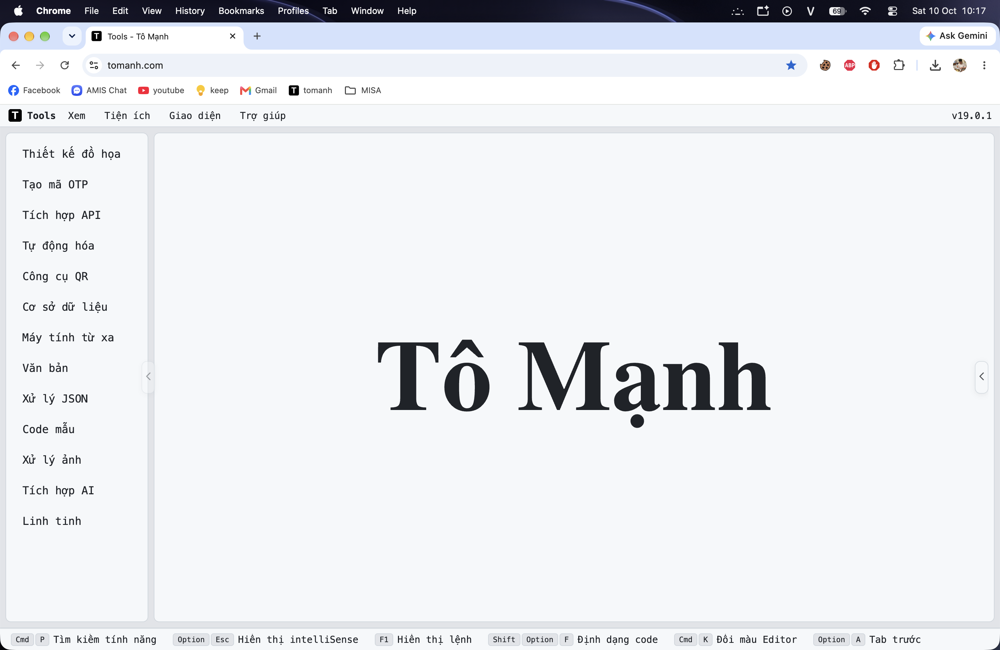

## Dự án: Công cụ Tiện ích cho Lập trình viên - Tổng hợp để tránh triển khai mỗi công cụ trên một trang web riêng biệt

Dự án này cung cấp một bộ sưu tập các công cụ hữu ích dành cho lập trình viên, được tổng hợp với mục tiêu tránh phải triển khai mỗi công cụ trên một trang web riêng biệt.

Đây là một **Ứng dụng Client-Daemon**.



🔗 [https://tomanh.com/](https://tomanh.com/)

---

## Tài liệu (AI-ready)

- [`AGENTS.md`](AGENTS.md) — hướng dẫn ngắn cho AI agent / người đóng góp (đọc trước).
- [`docs/architecture.md`](docs/architecture.md) — kiến trúc Client–Daemon, frontend/backend/WASM.
- [`docs/development.md`](docs/development.md) — build, chạy, debug, version & phát hành.
- [`docs/contributing.md`](docs/contributing.md) — luật đóng góp + checklist thêm tool/API.

---

## Cài đặt

### 1. Clone

Dự án này **không dùng Git Submodules** nữa: các file wasm đã build (`src_wasm/pkg/`) được commit thẳng vào repo, nên CI/Cloudflare chỉ cần `npm run build` mà không cần clone thêm gì. Source của các dự án ngoài (IronRDP, PhotoCraft, VectorCraft, GridCraft, WordCraft) chỉ được clone **khi bạn muốn build lại wasm**:

```bash
git clone https://github.com/tonguyenducmanh/devtools.git
cd your-main-repo

npm i

# (Tùy chọn) Nếu muốn build lại wasm, chạy scripts/build_wasm.sh
# -> script tự clone nguồn cần thiết về src_wasm/<tên>/external_repo/
```

## Chạy Dự án

### Phiên bản Web (Frontend)

```bash
npm run dev
npm run build
```

### API / Daemon (Backend)

Để build tất cả các dịch vụ backend:

```bash
chmod 777 ./build_all.sh
./build_all.sh
```

`build_all.sh` xuất ra `out/` cho 3 hệ điều hành, kèm bản nén để upload release:

| File | Nén |
|---|---|
| `dev-tool-mac-arm-<VERSION>` | `dev-tool-mac-arm-<VERSION>.tar.gz` |
| `dev-tool-linux-<VERSION>` | `dev-tool-linux-<VERSION>.tar.gz` |
| `dev-tool-window-<VERSION>.exe` | `dev-tool-window-<VERSION>.exe.zip` |

Nén xong binary thô bị xoá, nên `out/` chỉ còn lại file nén — upload thẳng cả thư mục này.

## Cấu hình

Các dịch vụ backend được cấu hình hoặc mặc định thông qua `config/config.json`.

Cấu hình dành riêng cho Frontend có thể tìm thấy tại: `src/cfg/config.js` (được bundle vào entry chunk khi build, không cần config realtime).

### Lưu trữ Dữ liệu (SQLite)

Công cụ này sử dụng **SQLite** (phía Go) để lưu trữ dữ liệu vào một file cục bộ.

- **File Cơ sở dữ liệu**: `dev_tool.db` (như định nghĩa trong `config.json`)
- Tất cả cấu hình, mock API do người dùng định nghĩa, và dữ liệu riêng của từng công cụ đều được lưu trong file này.
- SQLite được sử dụng để đảm bảo tính di động và dễ sao lưu — mọi thứ đều nằm trong thư mục cục bộ của bạn.

## WebAssembly

Thư mục dưới đây chứa nhiều công cụ được viết bằng các ngôn ngữ khác và biên dịch thành wasm để chạy trên ứng dụng web.

[Thư mục Web Assembly](src_wasm)

- **IronRDP** (`src_wasm/iron_rdp`): client RDP (Rust) → `src_wasm/pkg/rdp/`
- **.NET Wrapper** (`src_wasm/dotnet_wrapper`): wrapper C# (.NET 10) → `src_wasm/pkg/dotnet/`
- **PhotoCraft** (`src_wasm/photocraft`): trình chỉnh sửa ảnh (Rust, trunk) → `src_wasm/pkg/photocraft/`
- **VectorCraft** (`src_wasm/vectorcraft`): trình thiết kế vector (Rust, trunk) → `src_wasm/pkg/vectorcraft/`
- **GridCraft** (`src_wasm/gridcraft`): trình bảng tính (Rust, trunk) → `src_wasm/pkg/gridcraft/`
- **WordCraft** (`src_wasm/wordcraft`): trình soạn thảo văn bản (Rust, trunk) → `src_wasm/pkg/wordcraft/`

Build toàn bộ wasm bằng:

```bash
chmod 777 ./scripts/build_wasm.sh
./scripts/build_wasm.sh
```

Script tự clone nguồn external repo (IronRDP, PhotoCraft, VectorCraft, GridCraft, WordCraft) về `src_wasm/<tên>/external_repo/` nếu chưa có (không dùng git submodule) rồi build. Nếu chỉ muốn lấy nguồn mà chưa build:

```bash
chmod 777 ./scripts/fetch_wasm_sources.sh
./scripts/fetch_wasm_sources.sh
```

> **Trước khi build**, mỗi `build.sh` sẽ đi vào repo nguồn của nó và chạy
> `git pull origin` để lấy source mới nhất **nếu thư mục đó là git repo**
> (helper: `scripts/git_pull_if_repo.sh`). Các repo ngoài **luôn đứng trên nhánh
> mặc định** của origin (không pin commit nữa); nếu repo đang ở detached HEAD thì
> helper tự quay về nhánh mặc định rồi mới pull. Pull/checkout lỗi chỉ cảnh báo
> rồi vẫn tiếp tục build.

### Các tool "craft" (PhotoCraft / VectorCraft / GridCraft / WordCraft)

Các tool này ở sidebar chỉ làm đúng 1 việc: tải wasm về và load lên toàn màn hình trong một `<iframe>` (wasm app hoàn chỉnh, egui + WebGPU/WebGL2). File wasm luôn được `build.sh` nén gzip thành `_bg.wasm.gz` (vừa để dưới giới hạn **25 MiB/file của Cloudflare Pages**, vừa để tải nhanh hơn), `index.html` tự giải nén (DecompressionStream) khi tải. Vì vậy cần **build wasm trước** khi `npm run build` (nếu chưa build, folder `src_wasm/pkg/<tên>` trống và `npm run build` sẽ lỗi "No file was found to copy"):

```bash
# Cách 1: build riêng một tool
chmod +x ./src_wasm/photocraft/build.sh    # hoặc vectorcraft, gridcraft, wordcraft
./src_wasm/photocraft/build.sh

# Cách 2: build toàn bộ wasm (IronRDP + .NET + 4 craft tool)
chmod 777 ./scripts/build_wasm.sh
./scripts/build_wasm.sh
```

Phần nén wasm + patch `index.html` là logic **dùng chung** cho cả bốn tool, nằm trong
`scripts/wasm_dist_common.sh` và `scripts/patch_wasm_dist.py`.

Chi tiết từng tool: [src_wasm/README.md](src_wasm/README.md).
